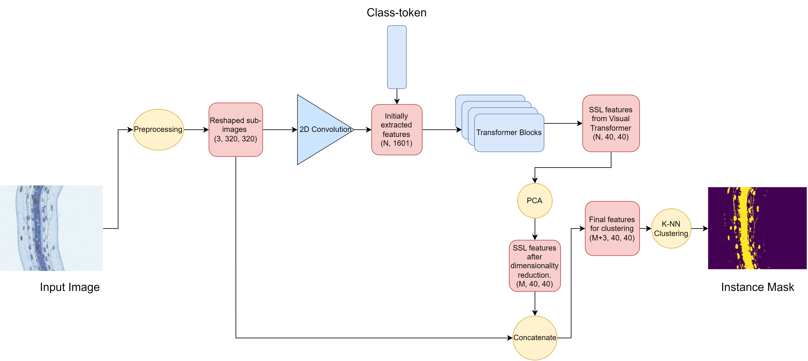
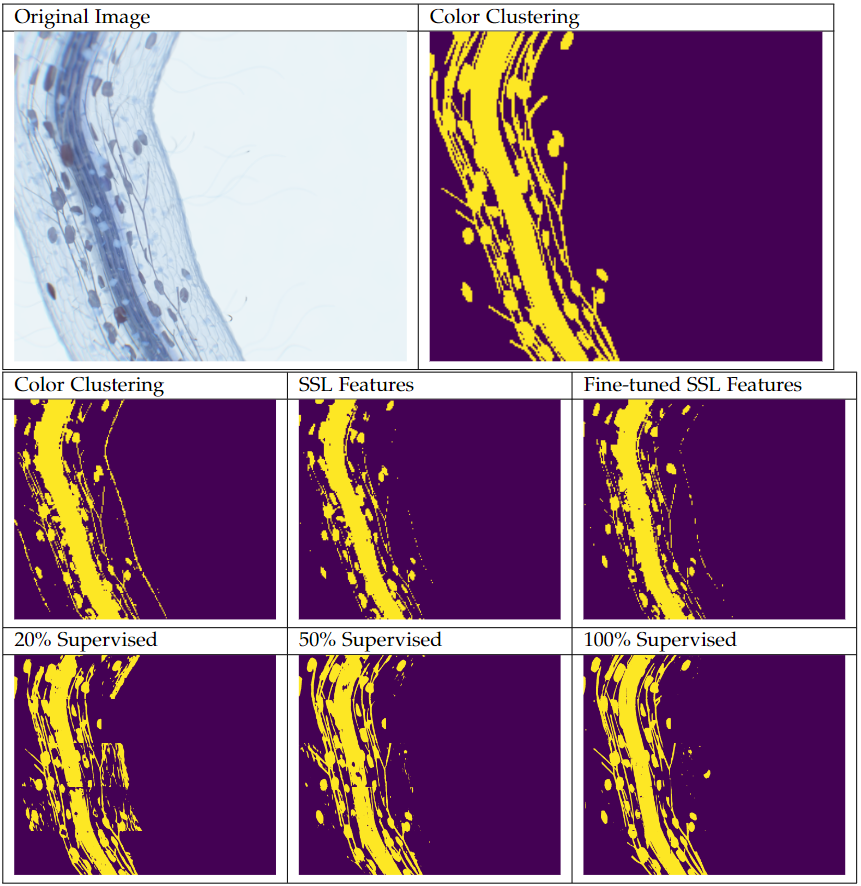
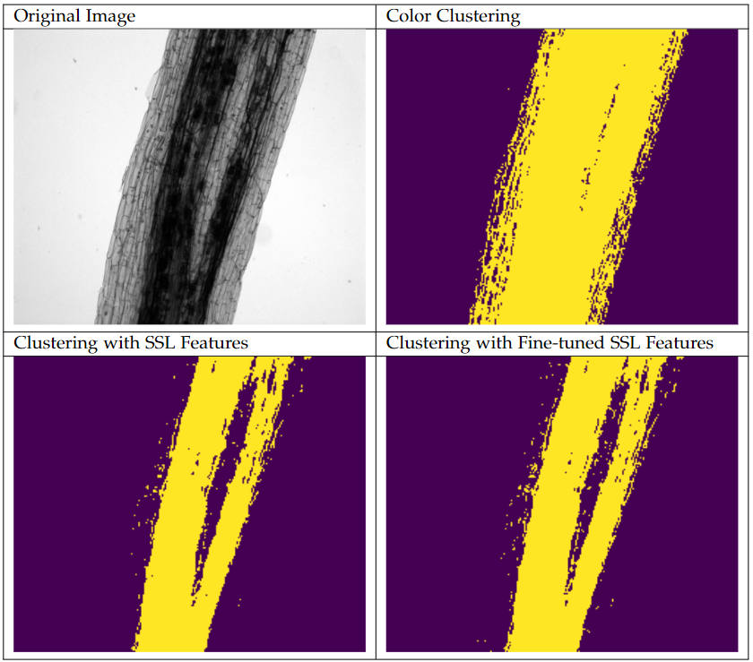

# Unsupervised Segmentation of Light Microscopy Images



Author: Baris Zongur
Examiner: Dr. Felix Dietrich


## Data Preparation

Preprocessing of the data for training both models can be done in prep_blender.ipynb notebook.

Synthetic data generation is done with following https://gitlab.lrz.de/dietrich/masterthesis. Replace blend file with the blend file
in this repository. 

Note: This project needs two seperate ground truth labels for each generated synthetic image. For first label, in compositing pipelane select "label2", "label3" and "label4" as the file output. For second set of label, change output to "label1". First label should look like 
examples/syn/000_l.tif. Second label should look like examples/syn/000l_1.tiff.  


## Inference

Experiments with SSL clustering can be done with infer_uns.py. To see the required arguments:

```
python infer_uns.py -h
```

One example experiment for SSL clustering:
```
python infer_uns.py --syn_dir "./examples/syn/000_r.tif" --syn_l1 "examples/syn/000_l.tif" --syn_l2 "examples/syn/000_1.tif" --model_path "./runs/ex4_syn_full.ckpt" --device cuda --is_ft T --is_syn T --pca_dim 3 --color_weight 0.3
```


Experiment with semi-supervised UNet model can be done with infer_sup.py. To see the required arguments:
```
python infer_sup.py -h
```
One example experiment with UNET:
```
python infer_sup.py --syn_dir "./examples/syn/000_r.tif" --syn_l1 "examples/syn/000_l.tif" --syn_l2 "examples/syn/000_1.tif" --model_path "./runs/full_semi_u_nonorm.ckpt" 
```


Pretrained models can be found under runs:
ex4_syn_full: Finetuned DINO model
full_semi_u_nonorm: Fully supervised UNET
full_semi_u_nonorm_20: 20% supervised UNET
full_semi_u_nonorm_50: 50% supervised UNET


## Training

Fine-tuning training of the DINO model can be done with:

```
python ft_training.py
```

Some important arguments:
```
path = PATH for preprocessed images.

args_train = {
    "batch_size": Batch size,
    "num_workers": 0,
    "lr": Learning rate for upsampler head,
    "lr_dino": Learning rate for the DINO model,
    "max_epochs": Maximum number of epochs,
    "print_every_n": Frequency of printing losses,
    "experiment": Experiment name for saving the model,
    "experiment_name": Experiment name for tensorboard logs
}

```
Training the UNET model can be done with:
```
python train_model.py
```
Some important arguments:

```
semi_path = Path to preprocessed images
semi_label = Path to labels


args_train = {
    "batch_size" : Batch size,
    "lr" : Learning rate for the model,
    "lr_dino" : Unrelevent/unused,
    "max_epochs": Maximum number of epochs,
    "print_every_n": Frequency of printing losses,
    "is_unet" : You can train supervised segmenter with DINO backbone if set false, setting True for UNET is recommended,
    "experiment": Experiment name for saving the model,
    "experiment_name" : Experiment name for tensorboard logs,
    "supervision_amount" : Number of subsamples for semi-supervision
}
```

## Example results






